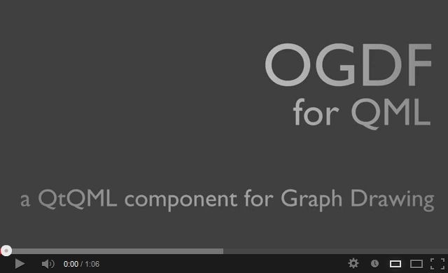

# OGDF for QML

This plug-in provides a binding of [Open Graph Drawing Framework](http://www.ogdf.net) to [QtQML](http://qt-project.org/doc/qt-5.0/qtqml/qtqml-index.html) (Version 5.0+).

The Open Graph Drawing Framework offers sophisticated algorithms and data structures for the automatic layout of diagrams. Some parts of OGDF are experimental and unstable, so don't expect all algorithms to work equally well.

## Features

- A wide range of [layout algorithms](http://www.ogdf.net/doku.php/tech:layouter) such as
    - Orthogonal and polyline layouts
    - Multilevel layouts
    - Energy-based layouts
    - Upward layouts
    - Planar layouts
    - Tree layouts
    - etc.
- Various generators for
	- Random graphs
	- Random trees
	- Random hierarchies
	- etc.
- Easy to use - it's QML after all

## Building

You need to have a C++ compiler, [Qt 5.0+](https://qt-project.org/downloads) and [CMake 2.8.11+](http://www.cmake.org/) installed.

There are many ways to [use CMake](http://www.cmake.org/cmake/help/runningcmake.html), but this is the easiest one: start [Qt Creator](http://qt-project.org/downloads#qt-creator), open `CMakeLists.txt` as new project, follow the instructions, hit build and you're done. 

## Quick Start

Once build, you can start `ogdf-demo` to find out what algorithms are available and how you want to use them to solve your problem.

  

To use the plug-in in your own project, you need to compile an `OGDF` directory and copy it to your application's working directory as follows:

    OGDF/                 -- plug-in directory
      libogdfplugin.so    -- compiled plug-in (Linux only)
      libogdfplugin.dylib -- compiled plug-in (OS X only)
      ogdfplugin.dll      -- compiled plug-in (Windows only)
      qmldir              -- module definition file

## Whats next?

Here are some quick links to help you get started:

- [Introduction](https://github.com/schulzch/qml-ogdf/wiki/Introduction)
- [Bug Tracker](https://github.com/schulzch/qml-ogdf/issues)
- [OGDF Forums](http://www.ogdf.net/forum/)

## License

Licensed under the [GNU Lesser General Public License](http://en.wikipedia.org/wiki/GNU_Lesser_General_Public_License) [Version 2.1](http://www.gnu.org/licenses/old-licenses/lgpl-2.1) or [Version 3.0](http://www.gnu.org/licenses/lgpl-3.0). Copyright (c) 2013 Christoph Schulz.

Note: OGDF is licensed under the [GNU General Public License](http://en.wikipedia.org/wiki/GNU_General_Public_License) [Version 2.0](http://www.gnu.org/licenses/old-licenses/gpl-2.0) or [Version 3.0](http://www.gnu.org/licenses/gpl-3.0). They kindly grand an exception to compile OGDF into this software and distribute it under weaker terms to prevent you from having legal issues when using this plug-in.
