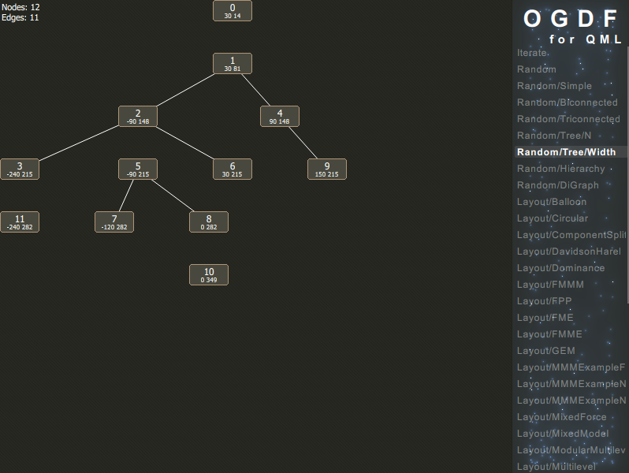

# OGDF for QML

This plug-in provides a binding of [Open Graph Drawing Framework](http://www.ogdf.net) (Version 2012.07) to [QtQML](http://qt-project.org/doc/qt-5.0/qtqml/qtqml-index.html) (Version 5.0+).

*Note: it's is quite useable, but far from mature (read: APIs may change)!*

## Features

- A wide range of [layout algorithms](http://www.ogdf.net/doku.php/tech:layouter) such as
    - Orthogonal and polyline layouts
    - Multilevel layouts
    - Energy-based layouts
    - Upward layouts
    - Planar layouts
    - Tree layouts
    - etc.
- Various generators for
	- Random graphs
	- Random trees
	- Random hierarchies
	- etc.
- Easy to use - it's QML after all

## Building

You need to have a C++ compiler, [Qt 5.0+](https://qt-project.org/downloads) and [CMake 2.8.10+](http://www.cmake.org/) installed. 

Start [Qt Creator](http://qt-project.org/downloads#qt-creator), open `CMakeLists.txt` as new project, follow the instructions, hit compile and you're done. Alternatively you can use CMake from the command line as follows:

1. Open up a terminal and navigate to the root directory
2. Create a build directory using `mkdir build; cd build`
3. Configure using `cmake -G "Unix Makefiles" ..`
4. Build using `make`

It's worth mentioning that `Unix Makefiles` can be replaced with your favorite CMake generator. See `cmake --help` or [online documentation](http://cmake.org/cmake/help/v2.8.10/cmake.html#section_Generators) for a list of available generators.

## Quick Start

Once build, you can start `ogdf-demo` to find out what algorithms are available and how you want to use them to solve your problem.

To use the plug-in in your own project, you need to compile an `OGDF` directory and copy it to your application's working directory as follows:

    OGDF/                 -- plug-in directory
      libogdfplugin.so    -- compiled plug-in (Linux only)
      libogdfplugin.dylib -- compiled plug-in (OS X only)
      ogdfplugin.dll      -- compiled plug-in (Windows only)
      qmldir              -- module definition file

## Whats next?

Here are some quick links to help you get started:

- [Introduction](https://github.com/schulzch/qml-ogdf/wiki/Introduction)
- [Bug Tracker](https://github.com/schulzch/qml-ogdf/issues)
- [OGDF Forums](http://www.ogdf.net/forum/)

## License

Licensed under the [GNU Lesser General Public License](http://en.wikipedia.org/wiki/GNU_Lesser_General_Public_License) [Version 2.1](http://www.gnu.org/licenses/old-licenses/lgpl-2.1) or [Version 3.0](http://www.gnu.org/licenses/lgpl-3.0). Copyright (c) 2013 Christoph Schulz.

Note: OGDF is licensed under the [GNU General Public License](http://en.wikipedia.org/wiki/GNU_General_Public_License) [Version 2.0](http://www.gnu.org/licenses/old-licenses/gpl-2.0) or [Version 3.0](http://www.gnu.org/licenses/gpl-3.0). They kindly grand an exception to compile OGDF into this software and distribute it under weaker terms to prevent you from having legal issues when using this plug-in.
